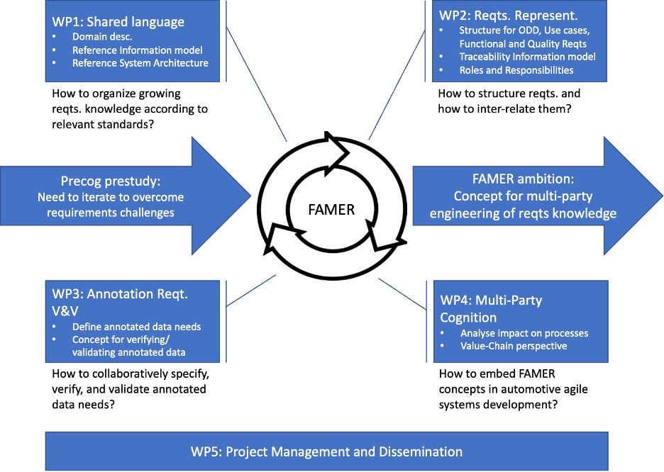

* * *

# The FFI Famer Project Test Page
We are proud to announce that on September 1st, 2023, we started to work on a new project funded by Vinnova FFI: FAMER – Facilitating Multi-Party Engineering of Requirements.
FAMER will establish concepts, models, and techniques for effectively building requirements knowledge for safe perception systems. FAMER approaches the requirements and challenges in a systems-of-systems context, in which several organizations and disciplines (multiple parties) must be brought together, and the complexity of the system under construction forces an iterative, collaborative approach across disciplines.
The project will run for three years and will be coordinated by the University of Gothenburg. Other partners include Kognic, RISE, Volvo Cars, and Zenseact, thus covering a highly relevant part of the automotive supply chain and enabling applied research in close contact with companies with relevant core business. The University of Gothenburg will provide its extensive expertise in Requirements Engineering and Agile Systems Development. Similarly, RISE will provide its expertise in Safety Engineering. Together, these two academic partners will conceptualize learnings beyond the critical IP of partner companies and drive joint publications. The industry partners Volvo Cars (OEM and System owner), Zenseact (Perception Systems), and Kognic (Data and Annotations) cover critical parts of the value chain of an automotive perception system. We foresee a tight collaboration between the academic parts and industrial aspects, where, similarly to the prestudy, practical challenges are understood, and theoretical solutions are suggested and applied to validate their applicability in the partner companies. A newly hired postdoctoral researcher will help to consolidate research across partners:

- A domain description and system reference architecture.
- An information model to manage the development of requirements knowledge.
- Demonstrate integration with multi-party agile work.

## Work package structure of the FAMER 

We believe that the ability to effectively agree on requirements across multiple parties will help increase traffic safety in a future that increasingly relies on automated vehicle technology. You can follow this project on the FAMER homepage at https://ffi-famer.github.io/ and contact Eric Knauss at eric.knauss@gu.se> for more information.
