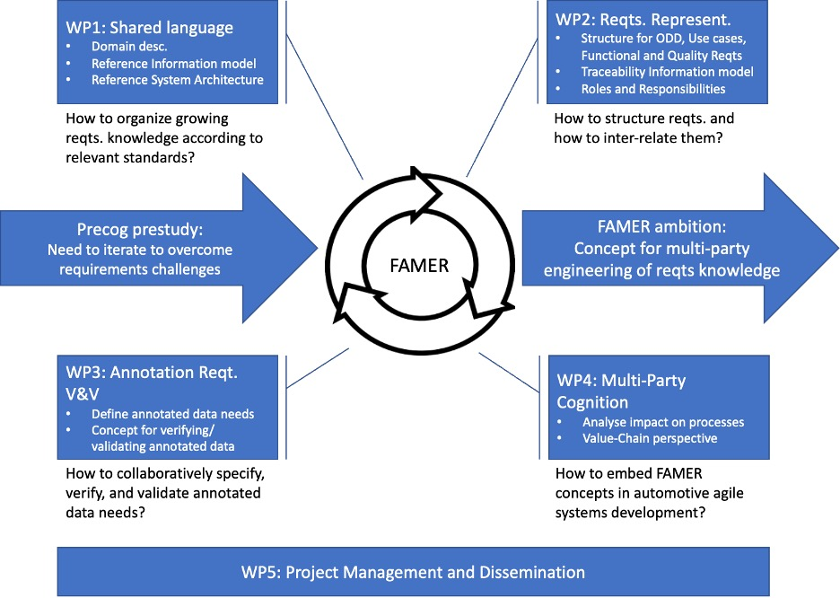

```md
* * *
<figure>
<center>

</center>
</figure>

# The FFI FAMER Project

FAMER – *Facilitating Multi-Party Engineering of Requirements* – is a three-year Vinnova FFI-funded project that started on **September 1, 2023**. The project develops concepts, models, and techniques for building and managing requirements knowledge for **safe AI-based automotive perception systems** in a **multi-party systems-of-systems context**.

Safe perception-system development requires collaboration across multiple organizations, disciplines, tools, and lifecycle stages. FAMER addresses this challenge by improving how requirements are represented, aligned, validated, and shared across the automotive value chain in iterative and collaborative development settings.

The project is coordinated by the **University of Gothenburg**, in collaboration with **Volvo Cars**, **Zenseact**, **Kognic**, and **RISE**. Together, the partners represent key parts of the automotive perception ecosystem, spanning requirements engineering, safety engineering, perception-system development, and data annotation.

FAMER focuses on three main outcomes:

- a domain description and reference architecture for safe perception systems,
- an information model for managing requirements knowledge across multiple parties,
- and support for integrating requirements knowledge into multi-party agile development.

## Partners and Roles

The **University of Gothenburg** coordinates the project and leads research on requirements representation and dissemination.  
**Volvo Cars** leads the work on establishing a shared language and common foundation for the project.  
**Zenseact** leads work on multi-party requirements cognition and supports integration into agile automotive development.  
**Kognic** contributes expertise in data annotation, validation, and annotation-related requirements.  
**RISE** contributes expertise in safety engineering, safety assurance, and dissemination.

## Emerging Results and Industrial Relevance

FAMER has already produced a growing body of results on requirements engineering for safe AI-based perception systems. Recent publications address requirements representations for multi-party collaboration, data annotation as a requirements engineering concern, practical challenges in managing annotation requirements, annotation quality problems, and structured approaches for annotation requirements representation and specification.

The completed papers show a clear progression of results. First, they highlight how requirements are represented and shared across multiple stakeholders in machine learning-based automotive perception development ([Saeeda et al., 2025](https://drive.google.com/file/d/1mT6g-ByFZ2u23Tzg1BwtZ81-wXtF2fEk/view)). A second stream of results establishes data annotation as a requirements engineering concern rather than only a data-processing activity. It shows that annotation decisions directly affect whether system-level goals, safety expectations, and quality requirements can be fulfilled in machine learning systems ([Peng et al., 2025](https://arxiv.org/abs/2512.13444)).

Further results show how annotation requirements emerge, evolve, and are managed in industrial autonomous-driving contexts, while also identifying recurring annotation quality problems that can propagate into downstream perception-system development and validation. In addition, structured solutions such as data annotation requirements representation and specification provide stronger support for traceability, reuse, and alignment between system goals and annotation decisions. Further details are available on the [FAMER Publications page](https://ffi-famer.github.io/famer_publications.html).

## From Project Objectives to Industrial Achievements

FAMER set out to improve how requirements knowledge is built, represented, validated, and shared for safe AI-based perception systems developed across multiple organizations. Its objectives included establishing a shared language, improving requirements representation and traceability, strengthening annotation-related verification and validation, and supporting multi-party agile development in a systems-of-systems context.

The results achieved so far show clear progress toward these goals. FAMER has generated scientific and practical insights into requirements representations, data annotation requirements, annotation quality problems, and structured specification approaches. These outcomes show that the project is translating its objectives into methods and knowledge relevant for industrial practice.

For the industrial partners, this has already created concrete value. **Volvo Cars** has strengthened the foundation for shared understanding and requirements alignment in perception-system development. **Zenseact** has gained support for collaborative and iterative requirements work in distributed automotive AI development. **Kognic** has advanced its understanding of annotation requirements, validation data, and annotation-tool needs, enabling better guidance for clients and more reliable ground-truth production. **RISE** has strengthened its work on safety assurance, standards-related knowledge, and innovation support for safe and trustworthy perception systems.

Overall, the achieved outcomes show that FAMER is delivering not only expected research outputs, but also concrete industrial relevance across the automotive perception value chain.

## Work package structure of the FAMER



## Vision and Impact

FAMER aims to strengthen the ability of multiple parties to agree on, manage, and evolve requirements for safe perception systems. In the long term, this supports safer and more effective development of automated vehicle technology and strengthens Swedish industry through better vertical and horizontal integration across the automotive value chain.

## Contact

You can follow the project on the [FAMER homepage](https://ffi-famer.github.io/).  
For more information, contact **Eric Knauss** at **eric.knauss@gu.se**.
```
