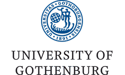
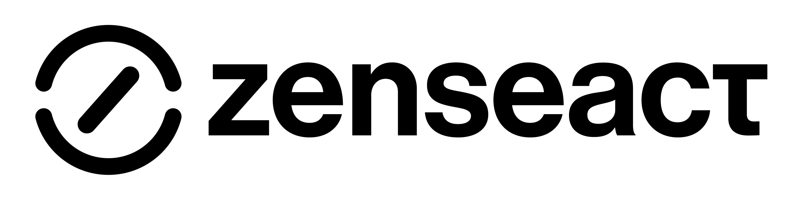
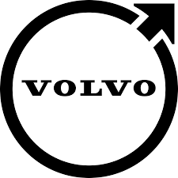

## 

The University of Gothenburg (UGOT) plays a key role in the FAMER project by coordinating the project and contributing across several work packages.

**Project Coordination:**  
UGOT coordinates the overall project, supports collaboration among partners, manages project activities, organizes bi-weekly meetings, and contributes to dissemination and communication.

**Work Package Leadership**

WP2: Requirements Representation: UGOT leads this work package, focusing on methods and representations for capturing, structuring, and tracing requirements for safe perception systems, including support for functional, non-functional, and ISO 26262-related requirements.

WP5: Project Management and Dissemination: UGOT leads project management and dissemination activities, ensuring coordination, communication of results, and collaboration with related initiatives.

**Participation in Other Work Packages**

WP1: Shared Language: UGOT contributes to establishing a shared language and reference information model for safe perception systems.

WP3: Annotation Requirements Verification and Validation: UGOT supports the definition, verification, and validation of annotation requirements to ensure alignment with system-level goals.

WP4: Multi-Party Requirements Cognition: UGOT contributes to training materials and focus group research to support the integration of FAMER results into distributed agile development.

# 

Zenseact plays an important role in FAMER by supporting collaborative requirements engineering across the automotive value chain and contributing to several work packages.

**Work Package Leadership**

WP4: Multi-Party Requirements Cognition: Zenseact leads this work package, focusing on how FAMER results can support distributed requirements knowledge and multi-party collaboration in agile automotive development.

**Participation in Other Work Packages**

WP1: Shared Language: Zenseact contributes to reviewing standards, defining the reference information model, and supporting the architecture description for perception systems.

WP2: Requirements Representation: Zenseact supports the development of requirements representations, methods, and traceability models across the lifecycle.

WP3: Annotation Requirements Verification and Validation: Together with Kognic, Zenseact contributes to defining annotation needs, producing annotated data, and validating whether the data satisfies system-level and safety-related goals.

WP5: Project Management and Dissemination: Zenseact supports coordination, dissemination, and collaboration through active participation in meetings and project activities.

# 

Volvo Cars has a central role in FAMER, contributing to multiple work packages and leading the effort to establish a shared foundation for the project.

**Work Package Leadership**

WP1: Shared Language: Volvo Cars leads this work package, focusing on building a shared language, domain description, reference information model, and architecture description for perception systems.

**Participation in Other Work Packages**

WP2: Requirements Representation: Volvo Cars contributes to defining requirements representations, specification methods, and traceability across the development process.

WP3: Annotation Requirements Verification and Validation: Volvo Cars works with Kognic and Zenseact to define annotation needs and validate annotated data against system-level goals.

WP4: Multi-Party Requirements Cognition: Volvo Cars supports focus group research and the integration of FAMER results into distributed agile automotive development.

WP5: Project Management and Dissemination: Volvo Cars contributes to project coordination, dissemination, and collaboration activities.

# Kognic

Kognic contributes to FAMER with expertise in annotation processes, annotated data, and validation in safety-critical perception system development.

**Work Package Leadership / Key Contribution**

WP3: Annotation Requirements Verification and Validation: Kognic plays a central role in this work package by contributing expertise in annotation needs, constraints, data generation, and validation to ensure that annotated data supports system-level and safety-related requirements.

**Participation in Other Work Packages**

WP1: Shared Language: Kognic contributes to the shared understanding of perception systems and annotation-related concepts.

WP2: Requirements Representation: Kognic supports the representation of annotation-related requirements and their traceability.

WP4: Multi-Party Requirements Cognition: Kognic contributes practical insights into collaboration across multiple stakeholders in the automotive value chain.

WP5: Project Management and Dissemination: Kognic supports dissemination, collaboration, and project coordination activities.

# RISE

RISE contributes to the FAMER project through research expertise, industrial collaboration, and support for methods related to safe and trustworthy perception systems.

**Participation in Work Packages**

WP1: Shared Language: RISE supports the development of common concepts, models, and architectural understanding for safe perception systems.

WP2: Requirements Representation: RISE contributes to methods for representing, structuring, and tracing requirements.

WP3: Annotation Requirements Verification and Validation: RISE supports activities related to defining and validating annotation requirements and quality.

WP4: Multi-Party Requirements Cognition: RISE contributes to knowledge sharing, training, and collaboration approaches for multi-party development.

WP5: Project Management and Dissemination: RISE supports dissemination, coordination, and engagement with relevant stakeholders and related initiatives.

