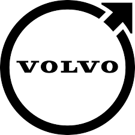

##   

The University of Gothenburg  (UGOT) plays a central role in the FAMER project, coordinating the overall efforts and contributing significantly to multiple work packages. Specifically, the University of Gothenburg's involvement includes:

**Project Coordination:** UGOT coordinates the project, ensuring the effective collaboration of all partners and overseeing project management activities. This includes organizing bi-weekly project meetings, managing a collaboration platform, and coordinating dissemination activities.

**Work Package Leadership** 

WP2: Requirements Representation: UGOT leads this work package, focusing on developing effective representations and strategies for capturing requirements for safe perception systems. This includes structuring and inter-relating requirements, specifying both functional and non-functional requirements, and ensuring traceability of requirements to fulfil ISO 26262.

WP5: Project Management and Dissemination: UGOT leads this work package, ensuring proper project coordination, dissemination of results through national and international networks, and management of relations with related projects.

**Participation in Other Work Packages**

 WP1: Shared Language: UGOT participates by helping to establish a shared language and reference information model for safe perception systems, contributing their expertise in requirements engineering and agile systems development.

WP3: Annotation Requirements Verification and Validation: UGOT contributes to defining annotation needs and constraints, as well as verifying and validating annotated data to ensure it meets system-level goals.

WP4: Multi-Party Requirements Cognition: UGOT contributes by compiling FAMER results into training materials and facilitating focus group research to integrate FAMER contributions into multi-party distributed agile development approaches.

#  

Zenseact plays a significant role in the FAMER project, contributing to multiple work packages with a focus on integrating collaborative requirements engineering across the automotive value chain. Their involvement includes:

**Work Package Leadership**  

WP4: Multi-Party Requirements Cognition: Zenseact leads this work package, defining how FAMER contributions can positively impact the automotive value chain and enable the distributed building of requirements knowledge across multiple partners in typical automotive-scaled agile systems development. They are responsible for integrating FAMER results into agile automotive systems development and evaluating feasibility and benefits based on a concrete case study.

**Participation in Other Work Packages** 

WP1: Shared Language: Zenseact collaborates with other partners to review standards and reference frameworks, define a reference information model, and develop a reference system architecture description for perception systems.

WP2: Requirements Representation: Zenseact works alongside other partners to extend shared understanding from WP1, define requirements representations and methods, and develop a traceability information model that connects various representations.

WP3: Annotation Requirements Verification and Validation: Zenseact, together with Kognic, leads tasks related to defining annotation needs and constraints, creating annotated data, and validating whether this data meets system-level goals. They focus on ensuring that annotated data contributes to fulfilling safety and other high-level requirements.

WP5: Project Management and Dissemination: Zenseact supports project management activities and dissemination efforts, promoting project results and managing relations with related projects. They participate in bi-weekly project meetings and other coordination activities.

# 

Volvo Cars plays a critical role in the FAMER project, contributing to and leading various work packages. Here is an overview of their involvement:

**Work Package Leadership**

WP1: Shared Language: Volvo Cars leads this work package, establishing a shared language and foundation for the project. This includes compiling a domain description, defining a reference information model, and creating a reference system architecture description for perception systems​.

**Participation in Other Work Packages**

WP2: Requirements Representation: Volvo Cars collaborates with other partners to develop requirements representations, define methods for specifying both functional and non-functional requirements, and establish a traceability information model that connects various requirements across the development lifecycle​.

WP3: Annotation Requirements Verification and Validation: Volvo Cars works with Kognic and Zenseact to define annotation needs, create annotated data, and validate whether the annotated data meets system-level goals. This ensures that annotations contribute to fulfilling safety and other high-level requirements​.

WP4: Multi-Party Requirements Cognition: Volvo Cars supports Zenseact in this work package by conducting focus group research and integrating FAMER results into multi-party distributed agile development approaches. They also help evaluate the feasibility and potential benefits of the contributions based on a concrete case study​.

WP5: Project Management and Dissemination: Volvo Cars supports project management activities and dissemination efforts, promoting project results and managing relations with related projects. They participate in bi-weekly project meetings and other coordination activities.​

# Kognic

# RI.SE
